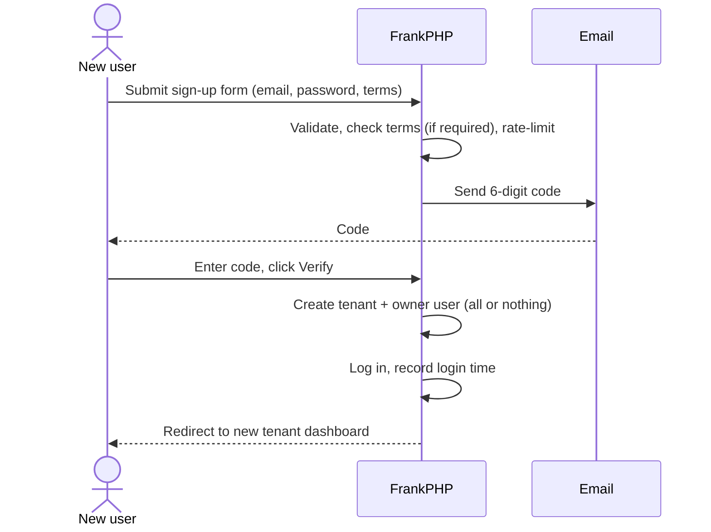

# Docs-site hand-off: FrankPHP v2.1.0: Users section

## Instructions for the docs agent

- **Audience:** human developers building apps on FrankPHP. Plain language. Show config and view snippets, not framework internals.
- **Where:** add a new top-level **Users** section with the five pages below. Fit them into the site's existing navigation, page template and tone. Merge or rename pages if the site already covers any of this; the headings here are suggestions.
- **Link** each page to the v2.1.0 changelog entry.
- **Mark as future work** (don't document as available): re-accepting terms when the version changes, a consent audit log, invite-a-user / join-an-existing-tenant, SSO.
- **Source of truth** if anything here seems unclear: `framework/codebase.md` §16.9 and `framework/CHANGELOG.md` [2.1.0] in the FrankPHP repo.

---

## Page 1: New User Sign-up Flow

A new user signs up in two steps, and the second step creates their account and their own tenant.

1. **Sign-up form** (`/signup`): email, password, confirm password, and (if the app enables it) a Terms & Conditions checkbox.
2. **Email verification:** FrankPHP emails a 6-digit code, valid for 15 minutes. The user enters it at `/signup/verify` and clicks **Verify & Create Account**.
3. **Account created:** FrankPHP creates a new tenant for the user, creates the user as that tenant's **owner**, and logs them straight in.
4. **Dashboard:** the user lands on their new tenant's dashboard.



Good to know:

- If the email is already registered, the form still says a code was sent. This is deliberate, so nobody can probe which emails have accounts.
- Sign-up requests are rate-limited per IP address (5 per hour by default).
- Creating the tenant and the user is all-or-nothing. If anything fails, neither is created and the user sees "Account creation failed. Please try again."
- The site owner (`MAIL_SITE_ADMIN`) gets an alert email when a code is requested and when an account is created. The second one names the new tenant.

---

## Page 2: Tenants & Ownership

**Every sign-up creates its own tenant**, and the person signing up becomes its **owner**. *(Changed in v2.1.0. Earlier versions added every sign-up to tenant 1 as a regular user.)*

### How the tenant is named

There is no "company name" field. FrankPHP names the tenant from the email address, which the owner can change later in **Tenant Settings**.

| Sign-up email | Tenant name | Tenant slug |
|---|---|---|
| `jane@acme-corp.com` | Acme Corp | `acme-corp` |
| `bob@mail.acme.co.uk` | Acme | `acme` |
| `jane.doe@gmail.com` | Jane Doe's Workspace | `jane-does-workspace` |

- **Business email:** named after the organisation's domain.
- **Personal email** (Gmail, Outlook, Hotmail, Yahoo, iCloud, Proton and other common providers): "*Name*'s Workspace".
- **Slugs are unique.** If `acme-corp` is taken, the next tenant gets `acme-corp-2`, then `acme-corp-3`, and so on.
- The tenant's company email is set to the sign-up email.
- Two colleagues who sign up separately get **two separate tenants**. Joining an existing tenant needs an invite flow, which is not in FrankPHP yet.

### Roles

| Role | Meaning |
|---|---|
| `owner` | Created the tenant at sign-up. Can manage tenant settings and users. |
| `admin` | Same management access as owner. |
| `user` | Standard member of the tenant. |
| `platform` | Site-operator role above tenant owners. Cross-tenant access is not finished yet. |

---

## Page 3: Terms & Conditions Acceptance

FrankPHP can require new users to accept your Terms & Conditions, and record **when** they accepted and **which version**.

### It's opt-in

The feature is **off unless you turn it on**. An app that upgrades to 2.1 without changing its config behaves exactly as before.

### Turning it on

In `app/Config/config.php`:

```php
'signup' => [
    'require_terms' => true,       // enforce + record acceptance
    'terms_version' => '2026-10',  // your current terms version (optional)
],
```

Change `terms_version` whenever your terms change.

**Existing installs:** run the v2.1.0 database migration first (see *Upgrading to 2.1.0*).

### What your sign-up form must do

The starter app's sign-up page already does all of this. If you've customised yours:

1. Include a checkbox named `terms_accepted` with value `1`:
   ```html
   <input type="checkbox" name="terms_accepted" value="1" required
          <?= (($terms_accepted ?? null) === '1') ? 'checked' : '' ?>>
   <label>I have read and agree to the <a href="/terms" target="_blank">Terms &amp; Conditions</a>.</label>
   ```
2. Show `$error`. If the box isn't ticked, the user sees: *"You must accept the Terms & Conditions to continue."*
3. Re-tick the box from `$terms_accepted` after any error (as above), so users don't have to tick it again.

**The browser checks are only a convenience.** A `required` checkbox or a disabled button can be bypassed. FrankPHP does the real check on the server.

### How it behaves

| `require_terms` | Box ticked? | Result |
|---|---|---|
| Off (or not set) | Either | Sign-up works as normal. Nothing is recorded. |
| On | No | Sign-up is refused with the message above. No code is sent. |
| On | Yes | Sign-up works, and the acceptance is recorded. |

### What gets recorded

- **When:** the date and time (UTC) the user submitted the sign-up form with the box ticked. This is not when they entered the code. It is kept if they ask for the code to be resent.
- **Which version:** your `terms_version` at that moment.
- Both are stored on the user. Users who signed up before 2.1, or while the feature was off, have no record. Don't invent one for them.
- If your checkbox also confirms something else (for example "I am over 18"), the same record covers it.

### The Terms page

The starter app includes a **placeholder** Terms page at `/terms`. **Replace its content with your real Terms & Conditions before going live.** Apps upgraded from an earlier version don't get this page automatically; copy it from the starter app if you want it.

---

## Page 4: Customising Sign-up

### Changing where new users go

By default every sign-up creates a new tenant. If your app works differently, for example clients who should join their coach's existing tenant, you can replace this rule in `app/bootstrap.php`:

```php
// Example: every sign-up joins tenant 1 as a regular user (the pre-2.1 behaviour)
$container->override(\Frank\Services\SignupTenantResolver::class, fn ($c) =>
    new class implements \Frank\Services\SignupTenantResolver {
        public function resolve(string $email, string $name): array {
            return ['tenant_id' => 1, 'role' => 'user'];
        }
    }
);
```

Your rule receives the verified email and the user's name, and returns the tenant id and role. It runs as part of the same all-or-nothing step, so anything it creates is undone if sign-up fails.

### Custom sign-up views

The sign-up views (`app/Views/auth/signup.php`, `signup-verify.php`) belong to your app, so you can restyle them freely. If Terms acceptance is on, keep the three requirements from *Terms & Conditions Acceptance*.

On the verify page, submit the code with a button and prevent the form being submitted twice. The starter page shows how. Auto-submitting when the 6th digit is typed can send two requests, and the second one logs the brand-new user out again.

---

## Page 5: Upgrading to 2.1.0

1. **Replace the `framework/` folder** with the 2.1.0 release, as for any update.
2. **Check the sign-up behaviour change.** New sign-ups now create their own tenant as owner. If your app needs a different rule, set it up first (see *Customising Sign-up*).
3. **Run the database migration** on each environment: `framework/sql/migrations/v2.1.0_signup_terms.sql`.
   - It adds four empty columns and changes no data.
   - It is safe to run more than once.
   - Existing users keep no terms record. That's expected.
4. **Optionally turn on Terms acceptance** in `app/Config/config.php`, and make sure your sign-up form meets the requirements above.

Do step 3 before step 4. If Terms acceptance is turned on before the migration, the sign-up pages show an error telling you to run `v2.1.0_signup_terms.sql`. Nothing else is affected, and running the migration fixes it.

Full details are in `framework/Versions/FrankPHP_v2.1.0_migration_notes.md` in the release.
